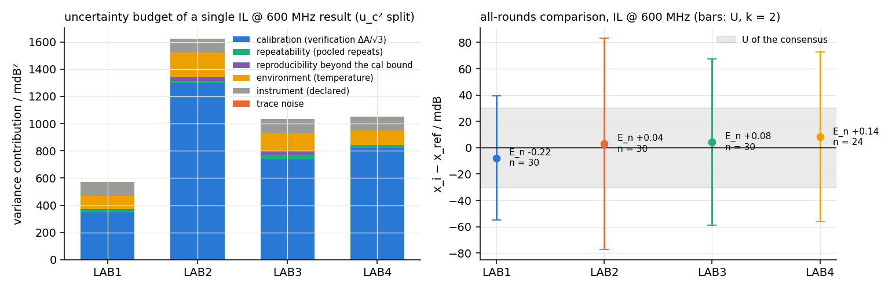
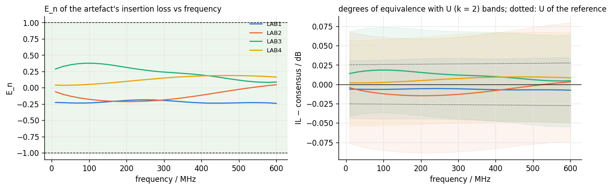
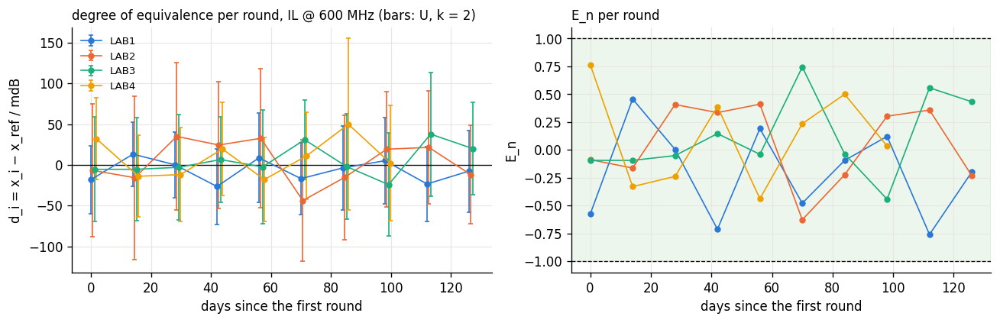
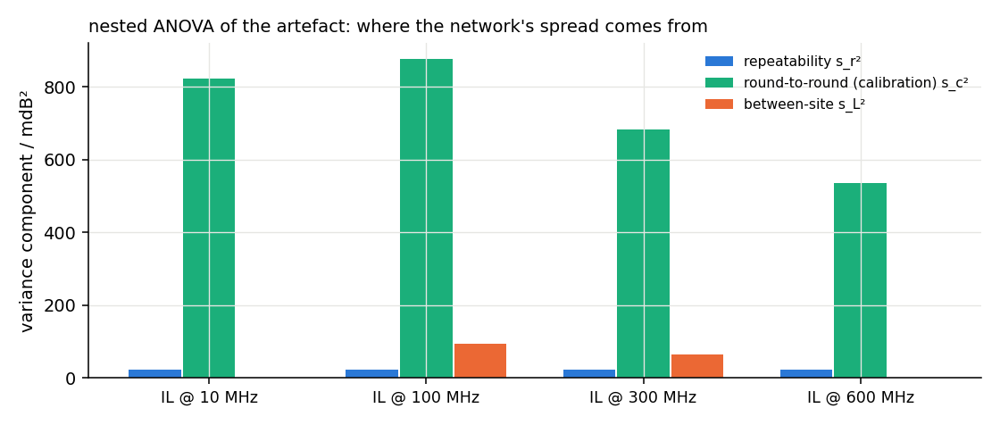
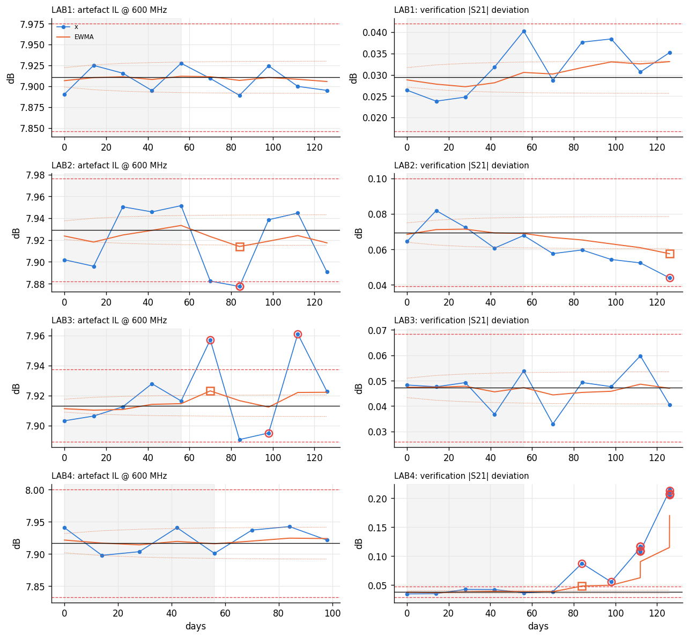
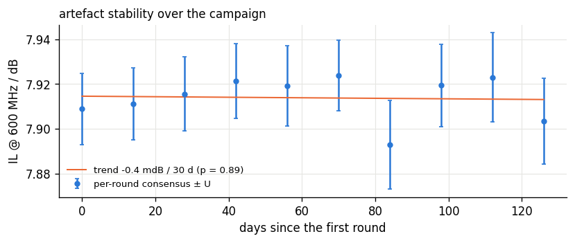
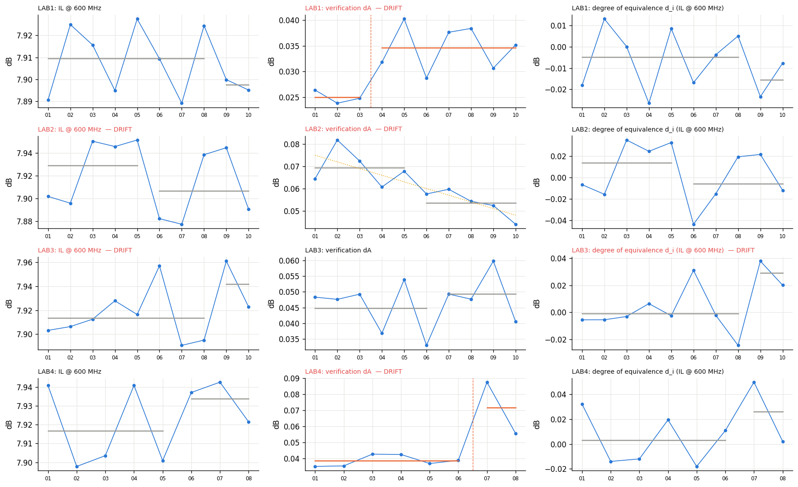

# What a network of laboratories needs to know

A single laboratory that produces trustworthy data (project B) still leaves the questions a company with several laboratories, or a laboratory that must satisfy an accreditation assessor, actually asks. Do the sites agree, and within what? Which site is drifting, and since when? What is the repeatability of one operator on one day, and what is the reproducibility across the network — and therefore how far from a limit a verdict can be trusted? Is the artefact we circulate stable, or are we chasing its aging? When a check failed on Monday, which certificates issued last week are affected? And for any single number on any certificate: what chain of records supports it?

`labplatform` answers these from the archives that project B's laboratories already produce. It adds no measurement of its own; it reads sealed job directories (raw files, sidecars, manifests) and laboratory databases, and everything it concludes is a query and a formula over what the sites recorded.

# Data model and ingest

One SQLite schema serves every site. `sites`, `instruments` (per site: role, identity from `*IDN?`), `calibrations` (per instrument: record id, type, ports, date, kit serial and due date, verification history), `samples` (kind: production or artefact), `procedures` (id, version, SHA-256, text), `runs` (one row per job: site, instrument, calibration, sample, procedure, operator, campaign and batch, timestamps, sample temperature and how it was inferred, ambient, state, trust, verdict, headline and its margin, attempts, calibration age and $\Delta T$, verification status and deviation, trace-noise estimate, sweep settings, archive path and manifest hash, software versions), `results` (scalar quantities per run with unit, standard uncertainty and the budget as JSON), `traces` (full traces as JSON), `verifications` and `events`.

The ingester reads a laboratory root: `lab.toml` for the site identity, every `manifest.json` under the archive for the sealed jobs, the calibration store, and the laboratory database for jobs that never produced data — refusals at a gate are rows too, because a network that cannot see refusal rates cannot manage them. Scalar quantities are derived from project A's traces at the comparison frequencies (insertion loss at 10, 100, 300 and 600 MHz; return loss, LCL, LCTL and NEXT as their worst value over the limit span and at 100 MHz; the windowed impedance scalars, NVP and delay; the loop resistance from the auxiliary measurement). Ingest is idempotent, and every result row is one hop from its raw file by the manifest hash.

# Uncertainty budgets

For every scalar result the platform evaluates a standard uncertainty in the spirit of the GUM [@gum2008],

$$u_c^2 = u_{\text{repeat}}^2 + u_{\text{reprod}}^2 + u_{\text{cal}}^2 + u_{\text{fixture}}^2 + u_{\text{instrument}}^2 + u_{\text{environment}}^2 + u_{\text{noise}}^2 + u_{\text{res}}^2, \qquad U = 2\,u_c,$$

from ingredients the sidecar of project B carries, and stores the budget with the result. The components are as follows.

*Repeatability* $u_{\text{repeat}}$ is the site's Type A repeatability for that quantity: the pooled within-round standard deviation of the artefact re-connections, $s_p^2 = \sum_j \sum_k (x_{jk} - \bar x_j)^2 / \sum_j (n_j - 1)$, which a single-run value carries in full ($s_p$, not $s_p/\sqrt n$); before any repeats exist a declared default is used and flagged as such.

*Reproducibility* $u_{\text{reprod}}$ is the site's calibration-to-calibration variation that the calibration bound does not already cover. With $\sigma_c$ the between-round standard deviation of the site's artefact round means (repeatability contribution $s_p^2/n$ removed), $u_{\text{reprod}} = \sqrt{\max(\sigma_c^2 - u_{\text{cal}}^2, 0)}$; counting the whole of $\sigma_c$ as well as $u_{\text{cal}}$ would count the same effect twice, and at the sites of the demonstration the calibration bound covers the observed round-to-round variation, so this term is zero there and would become non-zero only when a site varies more between calibrations than its verifications admit.

*Calibration* $u_{\text{cal}}$ bounds the systematic instrument error by the last calibration verification. For transmission quantities in dB the maximum $|S_{21}|$ deviation $\Delta A$ from the check standard's certificate is the half-width of a rectangular distribution, $u_{\text{cal}} = \Delta A/\sqrt3$. For reflection- and leakage-type levels $L$ (return loss, LCL, LCTL, NEXT) the residual floor is bounded by the return loss RL seen on the check standard, $u_\Gamma = 10^{-\mathrm{RL}/20}/\sqrt3$, and since the floor adds to $|\Gamma| = 10^{-L/20}$, $u_L = 8.686\,u_\Gamma/|\Gamma|$: a $-27$ dB return loss against a $-42$ dB floor carries $\pm1$ dB, which is the honest state of such a comparison and the reason the worst-case return loss of the demonstration is compared with $U \approx 0.9$ dB rather than the 0.09 dB an $|S_{21}|$-based bound would wrongly suggest. For impedance quantities $u_Z = 2 Z_{\text{ref}}\,u_\Gamma$ from the small-reflection expansion of $Z = Z_{\text{ref}}(1+\Gamma)/(1-\Gamma)$; for NVP the artefact's physical length enters at a declared $\pm0.3\,\%$.

*Fixture* $u_{\text{fixture}}$ is declared per fixture method of the procedure: none 0; port extension 0.01 dB; 2x-thru de-embedding 0.02 dB (the residual of the bisection of project A); 0.2 Ω on impedance when a fixture is removed. *Instrument* $u_{\text{instrument}}$ is the declared receiver linearity: 0.01 dB, 0.05 Ω, 0.02 % on NVP. *Environment* $u_{\text{environment}}$ comes from the temperature correction: every value is referred to $T_{\text{ref}} = 23$ °C with a stated relative coefficient $c$ per quantity kind ($x_{23} = x/(1 + c\,(T - 23))$; $c = 0.0025$/K for insertion loss, $0.00393$/K for the loop resistance, $-6\times10^{-5}$/K for impedance), with the label uncertainty $u(T) = 0.5$ K of project B's chamber model and a 30 % relative uncertainty of $c$: $u_T = |x|\sqrt{(c\,u(T))^2 + (0.3\,c\,(T-23))^2}$. *Noise* $u_{\text{noise}}$ is the trace-noise estimate of project B's validation check; *resolution* $u_{\text{res}}$ half the last stored digit. Not evaluated and declared as such: mismatch between the test-port match and the cable's impedance, and cable movement between calibration and measurement beyond what the verification saw.

Because the budget travels with the result, a comparison can say more than "site A differs from the reference": it says by how much, against what uncertainty of the difference, and therefore whether the difference is statistically distinguishable — the *compatibility statement* of §4.2. Figure \ref{fig:budget} (left) shows the split for a single 600 MHz insertion-loss result at each site: calibration dominates everywhere, which is the honest state of a network whose verification tolerance is 0.1 dB, and it is why the site with the loosest verifications (site 2) carries the largest $U$.

# Interlaboratory comparison

## Site values and reference value

For a quantity measured by every site on the same artefact, a site's value is the mean of its temperature-corrected results $\bar x_i$ and its uncertainty combines the systematic part of the budget with the observed spread,

$$u_i^2 = u_{\text{sys},i}^2 + \frac{s_i^2}{n_i}, \qquad u_{\text{sys},i}^2 = \overline{u_{\text{cal}}^2 + u_T^2 + u_{\text{noise}}^2},$$

where $s_i$ is the standard deviation of the site's values across re-connections and rounds — it covers connector repeatability and calibration-to-calibration variation together — or the pooled repeatability when $n_i < 3$. The reference value is either a designated reference site or a consensus obtained with Cox's largest-consistent-subset procedure [@cox2002]: the inverse-variance weighted mean

$$y = \frac{\sum_i x_i/u_i^2}{\sum_i 1/u_i^2}, \qquad u(y) = \Big(\sum_i 1/u_i^2\Big)^{-1/2},$$

is accepted if the observed $\chi^2 = \sum_i (x_i - y)^2/u_i^2$ does not exceed $\chi^2_{0.95}(N-1)$ (the Birge test [@birge1932]); otherwise the member with the largest $|E_n|$ is removed and the test repeated until the remaining set is consistent. Excluded sites are scored against the consensus but do not shape it.

## Scores

With the degree of equivalence $d_i = x_i - y$ and its uncertainty $u^2(d_i) = u_i^2 - u^2(y)$ for a member of the consensus (the correlation between a member and the mean it contributes to [@cox2002]) or $u_i^2 + u^2(y)$ otherwise, the scores are

$$E_n = \frac{d_i}{2\,u(d_i)}, \qquad \zeta = \frac{d_i}{\sqrt{u_i^2 + u^2(y)}}, \qquad z = \frac{x_i - x^*}{s^*},$$

with $|E_n| \le 1$ satisfactory, $1 < |E_n| \le 1.5$ questionable and $|E_n| > 1.5$ unsatisfactory per ISO 13528 and ISO/IEC 17043 [@iso13528; @iso17043], and $x^*$, $s^*$ the robust mean and standard deviation of the site values from Algorithm A of ISO 13528 Annex C (iterated winsorisation at $\pm1.5 s^*$ with the $1.134$ consistency factor). Each site also receives a *compatibility statement* in words — "site 2 differs from the reference by $+0.003$ dB; the expanded uncertainty of that difference is 0.074 dB ($E_n = +0.04$): not statistically distinguishable from zero — compatible" — because the sentence, not the score, is what goes into a report: it separates "differs" from "differs by more than we can resolve". $E_n$ judges a site against the uncertainty it *claims*; $z$ judges it against the *spread of its peers* and ignores claims. A site that reports a large $U$ and sits within it is satisfactory on $E_n$ — correctly — and the platform therefore also charts $U$ itself, through the verification deviation series of §6, so that a site whose uncertainty is growing is seen before it stops being satisfactory.

The same machinery runs at 30 frequencies over the insertion-loss traces, giving $E_n(f)$ per site (figure \ref{fig:enf}), and per round (figure \ref{fig:byround}): within a round a site's $n$ is its re-connections only and $u_{\text{cal}}$ is that round's verification, so the round-by-round view is where a site that starts drifting shows as a growing $d_i$, while the all-rounds comparison averages it away.

# Repeatability and reproducibility

The round-robin design is nested: sites, rounds within sites (each round on a fresh calibration on a different day), re-connections within rounds. With $a$ sites, $b$ rounds per site and $n$ re-connections per round, the mean squares

$$\mathrm{MS}_{\text{site}} = \frac{n b \sum_i (\bar y_{i\cdot\cdot} - \bar y)^2}{a - 1}, \quad \mathrm{MS}_{\text{round}} = \frac{n \sum_i \sum_j (\bar y_{ij\cdot} - \bar y_{i\cdot\cdot})^2}{a(b-1)}, \quad \mathrm{MS}_{\text{err}} = \frac{\sum_i \sum_j \sum_k (y_{ijk} - \bar y_{ij\cdot})^2}{ab(n-1)}$$

have expectations $\sigma_e^2$, $\sigma_e^2 + n\sigma_c^2$ and $\sigma_e^2 + n\sigma_c^2 + nb\sigma_a^2$, from which the variance components follow (negative estimates set to zero; unbalanced designs use the mean $n$ and $b$, an approximation stated as such). The repeatability, intermediate precision and reproducibility standard deviations are

$$s_r = \sigma_e, \qquad s_I = \sqrt{\sigma_e^2 + \sigma_c^2}, \qquad s_R = \sqrt{\sigma_e^2 + \sigma_c^2 + \sigma_a^2},$$

and the limits $r = 2.8\,s_r$, $R = 2.8\,s_R$ are the differences between two single results exceeded with 5 % probability under repeatability and reproducibility conditions [@iso5725_2; @iso5725_6]. Before the ANOVA, Cochran's test [@cochran1941] on the sites' within-round variances, $C = s^2_{\max}/\sum s_i^2$ against $C_{\text{crit}} = \big(1 + (p-1)/F_{\alpha/p}(\nu, (p-1)\nu)\big)^{-1}$, $\nu = n - 1$ (which reproduces the tables of ISO 5725-2 to three decimals), and Grubbs' test [@grubbs1969] on the site means look for a site out of line; both are reported and neither removes data automatically.

The reproducibility has a direct use: a production verdict whose headline margin is within $2 s_R$ of the limit is one that another site might have reversed. The platform counts these — a decision-rule question in the sense of ILAC G8 [@ilac_g8] — and lists them.

# Control charts

Each site's repeated measurements are charted: the artefact's insertion loss at the comparison frequencies and its fitted impedance as *round means* (repeats within a round share a calibration and would otherwise set limits from the re-connection scatter alone, flagging every recalibration), the calibration verification deviation $\Delta A$ and return loss, and the trace-noise estimate of every artefact run. The individuals chart takes its centre line and $\hat\sigma = \overline{\mathrm{MR}}/d_2$ ($d_2 = 1.128$) from a phase-I window of the first $m$ points, with action limits at $\pm3\hat\sigma$; the Western Electric rules [@westernelectric1956; @montgomery2020] — one point beyond $3\sigma$, two of three beyond $2\sigma$, four of five beyond $1\sigma$, eight in a row on one side — are evaluated from the first phase-II point on. An EWMA chart [@roberts1959] on the same series,

$$z_k = \lambda x_k + (1-\lambda) z_{k-1}, \qquad \mathrm{CL} \pm L\,\hat\sigma\sqrt{\frac{\lambda}{2-\lambda}\big(1 - (1-\lambda)^{2k}\big)}, \qquad \lambda = 0.2,\ L = 2.7,$$

detects the small sustained shifts that Shewhart misses. Rule 1, rule 2 and EWMA signals become events; rules 3 and 4 are annotated on the chart. Figure \ref{fig:charts} shows the $\Delta A$ chart doing exactly what it is for: site 4's verification deviation leaves its limits at round 7, three rounds before the gate of project B refuses to measure.

# Artefact stability

A circulating artefact ages; a network that does not test for it will attribute its drift to its sites. The platform fits a straight line to the per-round consensus value against time (and to each site's round means) and reports the slope per 30 days, its standard error and the $p$-value of a zero slope. In the demonstration the 600 MHz insertion loss trends by $-0.6$ mdB per 30 days with $p = 0.82$ — no drift — while the loop resistance shows a "significant" $p = 0.03$ with a slope of $3.5\,\mu\Omega$ per 30 days, a useful reminder that a $p$-value without an effect size is not a finding.

# Longitudinal drift and root cause

The per-round comparison asks whether the sites agreed in round 7; the longitudinal question is whether a site's measurement system is drifting, and why. For each site and each series — round means of the artefact's insertion loss at the comparison frequencies, its worst-case return loss and fitted impedance, the calibration verification deviation $\Delta A$, and the site's degree of equivalence $d_i$ per round — three detectors run: a least-squares trend with its $p$-value; a single change point by the maximum two-sample $t$ statistic over all splits with at least two rounds per side (first level of binary segmentation) with a Bonferroni correction for the number of splits tried,

$$t_k = \frac{\bar x_{k:} - \bar x_{:k}}{s_p\sqrt{1/k + 1/(n-k)}}, \qquad p_{\text{corr}} = \min\big(1, (n - 3)\,p(t_{k^*})\big);$$

and the EWMA of §6. A series that trips any detector is *drifting*, and the platform then does what a laboratory manager would: it lines the series up against project B's metadata for the same rounds — recalibration dates, the verification $\Delta A$ and return loss, the ambient and sample temperature, humidity, operator, procedure hash, firmware, kit serial — and against the site's own production results over the same fortnights. For each candidate it reports whether it changed at the change point (a categorical coincidence), the Pearson correlation over rounds (a numeric one), and a plain-language hypothesis; recalibration is discounted as uninformative when it happens every round. The discrimination that matters most is artefact against product: if the production results moved with the artefact, the measurement system changed; if only the product moved, the product did — which is where project E's manufacturing correlation takes over.

Figure \ref{fig:drift} shows the outcome on the demonstration. Site 4's verification deviation has a significant change point at round 7 (shift $+0.033$ dB, Bonferroni-corrected $p < 0.05$), correctly attributed as instrument-side evidence from the check standard — test cable, connectors or kit — independent of the artefact. Site 2's worst-case return loss shifts at round 3 with the strongest correlate its verification return loss ($r = +0.79$): a residual-directivity story, and one the $\pm0.9$ dB uncertainty of that quantity already declared. Sites 1 and 2 show small but significant movements of $\Delta A$ (a $+0.010$ dB step, a $-0.006$ dB per 30 days trend) that no metadata explains, which is what a real network would see too: not every detected change has a cause in the records, and the platform says so rather than inventing one.

# The trust layer

A result the platform hands on is not a number but a record. `labplatform card RUN_ID` renders, for any run and quantity, the value with its expanded uncertainty; the sample; the measurement (time, procedure, attempt, trust, verdict); the site and operator; the instrument identity; the calibration record with kit serial and due date and the verification that covers it; the fixture; the sample temperature, how it was inferred, and the reference temperature it was corrected to; the procedure hash; the raw files and their hashes, the manifest hash and the archive's integrity state re-checked at that moment; the software versions; the uncertainty budget component by component; the round, the degree of equivalence and $E_n$ against the reference of that round; and a status — compatible, questionable, incompatible — with a SUSPECT flag when a later verification on that instrument failed. The dashboard shows one card per site and the evidence pack embeds them; `figures/trust_card_example.txt` holds the demonstration's. The point is the one made in §1: `RL = −24.3 dB` is a datum; the card is a claim someone can check.

# Traceability

**The chain.** For any run, `labplatform chain` assembles: the result values with their budgets; the run row; the raw files and their SHA-256 from the archive manifest, with the archive's integrity re-verified at query time; the procedure (id, version, hash); the instrument identity; the calibration record with kit serial and due date and its verification history against the named check standard; the site; and the software versions. Every link is a stored value, not a live lookup, which is what ILAC P10's notion of a documented, unbroken chain asks for [@ilac_p10], and `labplatform evidence` writes it, with the site's comparison scores at the time and the relevant events, as a JSON dossier for a test report or an assessor.

**Retrospective invalidation.** When a verification fails, the results taken since the last *passed* verification on that instrument were produced under equipment that may already have been wrong. `suspect_runs` lists them (once, however many times the failure is re-verified), records an action event for each, and leaves the decision — re-measure, recall, annotate — where ISO/IEC 17025 leaves it, with people [@iso17025]. In the demonstration these are the five results site 4 took in round 8.

# The demonstration

`labplatform demo` builds four laboratories with project B's simulators — each with its own analyser serial and residual-error signature, calibration quality, ambient temperature and operator — and runs ten fortnightly rounds: every site recalibrates the day before, verifies against its check standard, measures the circulating artefact (a 15 m 1000BASE-T1 pair whose physics is identical at every site because it is seeded from the sample id) three times with re-connection, and two of its own production samples. Site 4's test cable degrades from round 7 (calibration quality factor 2.2: a transmission bias of about 0.04 dB and a larger residual ripple, still inside the 0.1 dB verification tolerance most of the time) and fails outright in the last round.

What came out of 200 jobs: sites 1–3 had all 50 jobs trusted (8 production FAILs each at sites 2 and 3 are the lossy and defective samples they were given); site 4 had 40 trusted and 10 refused at the calibration gate, its last verification failing at $\Delta A = 0.207$ dB. In the all-rounds comparison every insertion-loss $E_n$ lies within $\pm0.4$ (consensus $7.9149 \pm 0.030$ dB at 600 MHz; site $U$ from 0.043 dB at site 1 to 0.078 dB at site 2) and every site is compatible on every quantity; the worst-case return loss, compared with the directivity-based $U \approx 0.9$ dB it deserves, agrees to within $E_n = 0.2$ — with an $|S_{21}|$-based bound it would have shown a spurious $E_n = -2$ at site 2. The nested ANOVA gives, at 600 MHz, $s_r = 4.6$ mdB (re-connection), $s_I = 23.6$ mdB (round to round, i.e. calibration to calibration) and a between-site component below resolution, hence $s_R = 23.6$ mdB and $R = 0.066$ dB; at 100 MHz a between-site $s_L$ of 9.7 mdB appears. No production verdict lies within $2 s_R = 0.047$ dB of its limit. The artefact is stable. The platform raises 41 events, 20 at action level, of which the informative ones are site 4's: the verification deviation beyond $3\sigma$ at round 7 ($\Delta A = 0.088$ dB, $z = +16$) and a significant change point there, again beyond limits at rounds 9 and 10 when the verifications failed, an EWMA signal on its trace noise, and the five suspect runs of round 8. The lesson the numbers teach is the one stated in §4: a degrading site stays "satisfactory" on $E_n$ as long as its verification honestly inflates its uncertainty; what catches it is the chart on that uncertainty.

# What this does and does not show

Shown: a canonical multi-site schema fed from project B's archives with refusals included; per-result GUM budgets with eight named components from recorded and declared ingredients; $E_n$, $\zeta$ and $z$ scores and compatibility statements with a consensus reference by Cox's procedure, per quantity, per frequency and per round; nested-ANOVA precision with Cochran and Grubbs screening and a verdicts-at-risk count; Shewhart/EWMA charts with rational subgroups; artefact stability; drift detection with change points and root-cause attribution against the sites' metadata and production results; the trust card; the traceability chain, evidence packs and retrospective invalidation; a self-contained dashboard; 16 tests that check the statistics against known answers (variance components recovered from synthetic data, Cochran critical values against the ISO table, LCS exclusion, Algorithm A robustness, chart rules and change points on a step, attribution on a constructed series) and the platform end to end on a two-site network with a degrading site.

Not shown: real sites. The site differences are those of the simulator — residual-error signatures, calibration quality, ambient — and the temperature coefficients, the fixture and instrument terms and the 0.5 K label uncertainty are declared constants, not measured ones. The budget omits mismatch and cable-movement terms; root-cause attribution is correlation and coincidence, evidence for a person to weigh, not a diagnosis; the ANOVA uses balanced formulae on a nearly balanced design; the control-chart phase I is short (five rounds) because the campaign is. None of the statistics is novel — that is the point: they are the standard ones, implemented so that a laboratory's own data can be run through them, with every formula and constant in the open.

# References
